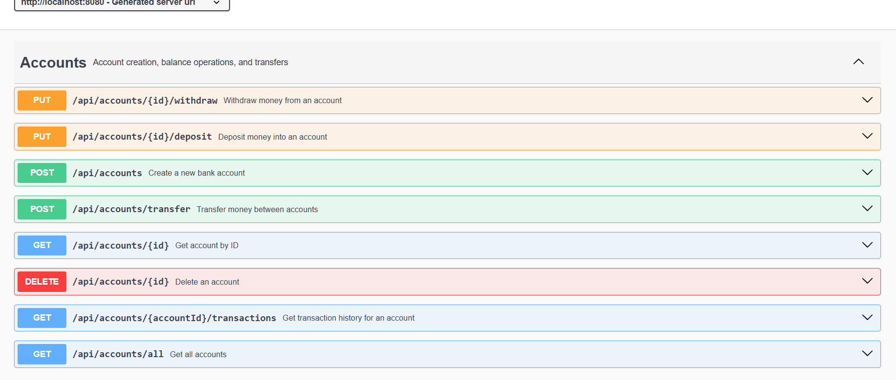
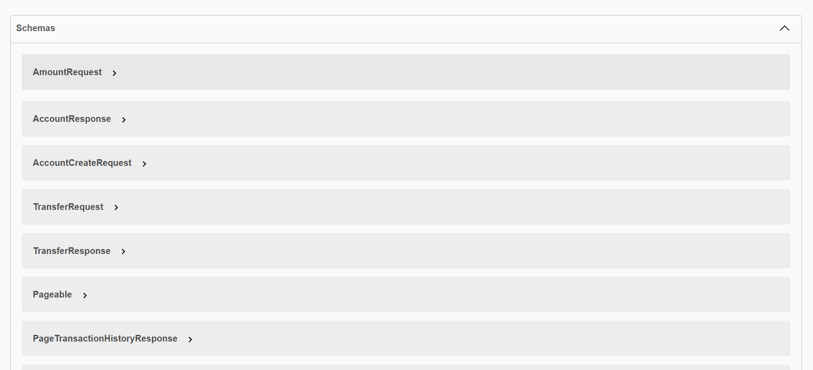
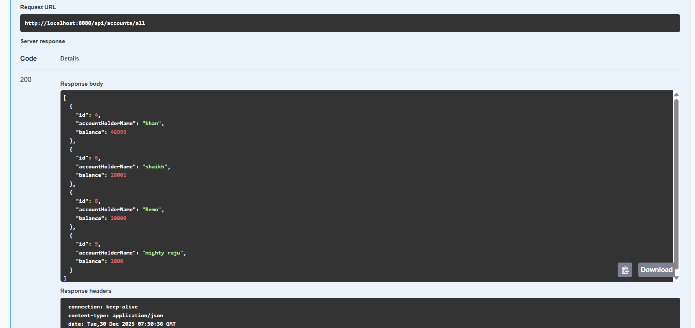
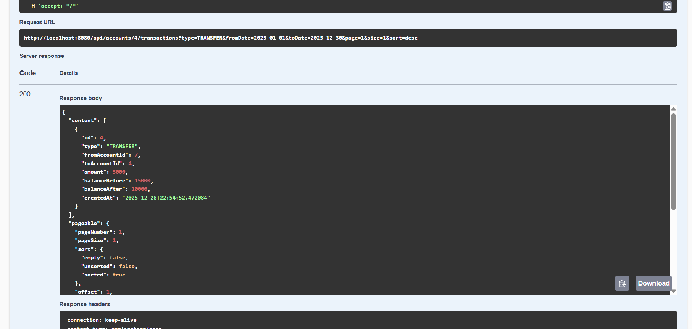

PrimeVault – Banking Backend Application

PrimeVault is a backend banking system built using Java and Spring Boot, designed to demonstrate real-world backend development concepts such as transaction management, pagination, filtering, clean architecture, and Dockerized deployment. The project focuses on backend correctness, data integrity, and scalability rather than UI complexity.

------------------------------------------------------------------

Key Features

Account Management
- Create bank accounts
- Deposit and withdraw money
- Atomic balance updates using transactional boundaries

Transaction Management
- Immutable transaction history
- Supports DEPOSIT, WITHDRAW, and TRANSFER operations
- Each financial operation creates a persistent audit record

Transaction History
- Paginated transaction history retrieval
- Optional filtering by:
    - Transaction type
    - Date range
- Efficient querying using Spring Data JPA and Pageable

Data Integrity and Reliability
- Uses @Transactional to ensure atomic operations
- Prevents partial updates and inconsistent balances
- Centralized exception handling using @ControllerAdvice
- Custom domain exceptions for error clarity

API Documentation
- Integrated Swagger (OpenAPI)
- Interactive endpoint exploration and testing
- Clear request and response schemas

Infrastructure and Deployment
- Dockerized backend and database
- MySQL running in a Docker container
- Environment-specific configuration using Spring Profiles

------------------------------------------------------------------

Technology Stack

Backend:
- Java 17
- Spring Boot
- Spring Data JPA
- Hibernate

Database:
- MySQL

API Documentation:
- Swagger (springdoc-openapi)

Infrastructure:
- Docker
- Docker Compose

------------------------------------------------------------------

Project Architecture

The application follows a layered architecture to ensure separation of concerns and maintainability.

Controller Layer
- Handles HTTP requests and responses
- Accepts request parameters and DTOs
- Delegates business logic to the service layer

DTO Layer
- Defines request and response models
- Prevents direct exposure of database entities
- Stabilizes API contracts

Service Layer
- Contains business logic
- Manages transactions
- Enforces domain rules

Repository Layer
- Handles database interactions
- Uses Spring Data JPA
- Supports pagination and filtering

Entity Layer
- Maps domain models to database tables
- Uses JPA and Hibernate annotations

Database
- MySQL database
- Persistent storage via Docker volumes

------------------------------------------------------------------

Swagger API Documentation

Once the application is running, Swagger UI is available at:

http://localhost:8080/swagger-ui/index.html

Swagger provides:
- Complete list of API endpoints
- Request and response schemas
- Interactive API testing

------------------------------------------------------------------
Swagger Overview  

Schemas

Account APIs  

Transaction History  

------------------------------------------------------------------

Running the Application with Docker

Prerequisites
- Docker
- Docker Compose

Steps

1. Clone the repository
   git clone https://github.com/ubaidulla/prime-vault.git

2. Navigate to the project directory
   cd primevault

3. Build and start the application
   docker compose up --build

Application Details
- Backend runs on http://localhost:8080
- MySQL runs in a Docker container
- Database data persists using Docker volumes

------------------------------------------------------------------

Environment Configuration

The application supports multiple environments using Spring Profiles.

Local Profile
- Uses a locally running MySQL instance

Docker Profile
- Uses MySQL running inside Docker

The active profile is controlled using the environment variable:

SPRING_PROFILES_ACTIVE

------------------------------------------------------------------

API Testing

APIs can be tested using:
- Swagger UI
- Postman
- curl

Pagination example:

?page=0&size=10&sort=createdAt,desc

------------------------------------------------------------------

Planned Enhancements

- JWT-based authentication
- Role-based access control (RBAC)
- Secured Swagger endpoints
- Frontend dashboard using React or Angular
- Cloud deployment on AWS

------------------------------------------------------------------

Author

Ubaidulla  
Java Backend Developer

Core Focus Areas
- Backend system design
- Transaction safety
- Scalable API development
- Dockerized backend applications

------------------------------------------------------------------

Contact Information

Author: Ubaidulla  
Role: Java Backend Developer

For feedback, questions, or professional discussions related to this project, you can reach out using the following channels:

Email:
ubaidulla.cse01@gmail.com

GitHub:
https://github.com/Ubaidulla1810

------------------------------------------------------------------

License

All Rights Reserved.

This project is the intellectual property of Ubaidulla Khan.  
The source code is publicly visible on GitHub for review and evaluation purposes only.

Unauthorized copying, redistribution, modification, or commercial use of this code is not permitted without explicit written permission from the author.

------------------------------------------------------------------

